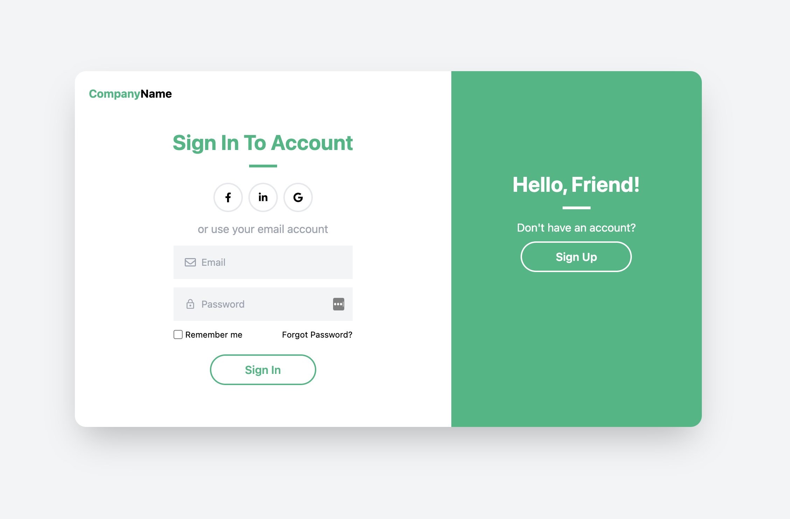

## Login Page UI in Next JS with Tailwind CSS



Having trouble deploying the Next.JS to Github pages, so to run the project, download and npm start I suppose? 

Or if you are Julia, you can access this "tutorial-next-js-login-with-tailwind" in the TUTORIALS folder in your React folder.

Original Youtube Tutorial: https://www.youtube.com/watch?v=G1edEyAnEZY

<hr/>

### Notes

Next JS official website: https://nextjs.org/
Tailwindcss official website: https://tailwindcss.com/
Creating a Next.js Tailwind project: https://tailwindcss.com/docs/guides/nextjs

```
npx create-next-app -e with-tailwindcss my-project
cd my-project
```

open in Visual Studio Code using code . when you are in the appropriate directory.

4:52 ```npm install react-icons --save```
(start using the react icons at 20:51)

Installed the extension Tailwind CSS IntelliSense into VSCode

10:00 - having some difficulty with the rounded corners;
aaahhh omg it was because it because the syntax was "rounded-2xl" and not "rounded-2x1" haha